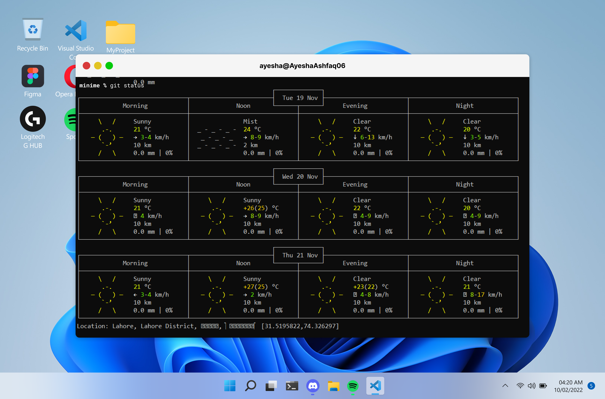

# Lahore Weather CLI
 

## Overview
Weather Check App is a lightweight utility developed using a `.bat` script. When executed, it provides real-time weather updates for the city of Lahore, which is predefined in the script's backend.

## Project Image
Below is a preview of the Weather Check App in action:  

## Features
- Fetches and displays current weather updates for Lahore.
- Lightweight and easy to execute as a `.bat` file.

## Usage
1. Download the `.bat` file to your system.
2. Double-click the file to run it.
3. The weather information for Lahore will be displayed in the terminal.

## Requirements
- A Windows operating system.
- Active internet connection.

## Limitations
- Currently supports only the city of Lahore.  

## License
This project is licensed under the MIT License.
